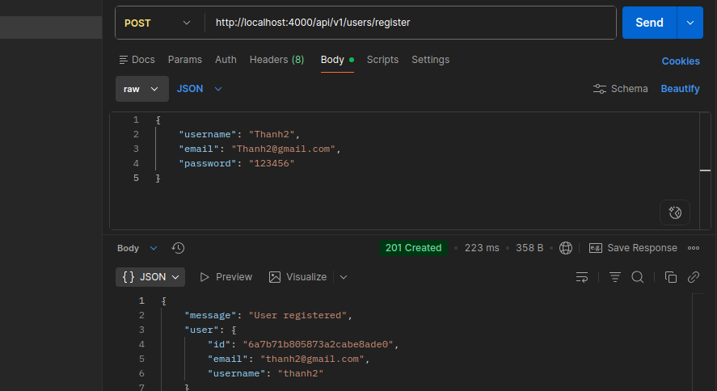
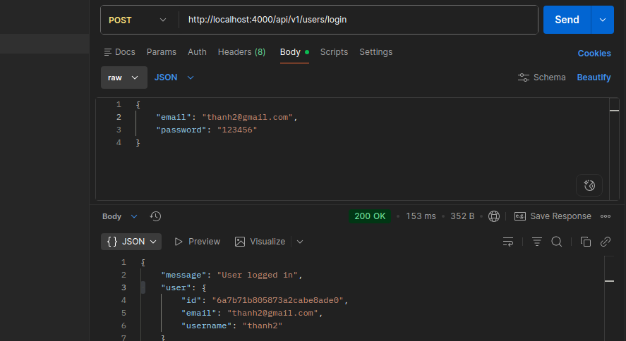
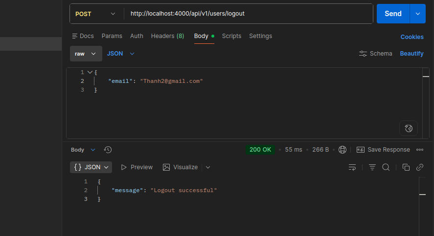

# Intro to Backend

A beginner-friendly backend project built while learning **Node.js, Express.js, MongoDB, and REST API development**.

The project focuses on understanding backend fundamentals through hands-on implementation rather than only theory.

## 🚀 Tech Stack

* **Node.js** — JavaScript runtime
* **Express.js** — Web framework
* **MongoDB Atlas** — Database
* **Mongoose** — MongoDB ODM
* **bcrypt** — Password hashing
* **dotenv** — Environment variable management
* **Nodemon** — Development server

## 📁 Project Structure

```text
introduce_backend/
├── backend/
│   └── src/
│       ├── config/
│       │   └── database.js
│       │
│       ├── controllers/
│       │   ├── post.controller.js
│       │   └── user.controller.js
│       │
│       ├── models/
│       │   ├── post.model.js
│       │   └── user.model.js
│       │
│       ├── routes/
│       │   └── ...
│       │
│       └── index.js
│
├── .env
├── .gitignore
├── package.json
└── README.md
```

## 📚 What I'm Learning

### Backend Fundamentals

* HTTP request and response
* HTTP status codes
* REST API concepts
* Express.js routing
* Controllers
* Middleware
* Error handling
* Environment variables

### MongoDB & Mongoose

* Connecting Node.js to MongoDB Atlas
* Creating schemas and models
* CRUD operations
* Mongoose validation
* MongoDB documents
* `ObjectId`
* Timestamps

### Authentication

* User registration
* User login
* Password hashing with bcrypt
* Password comparison
* Authentication flow

## 🔐 User Authentication

The project implements a basic authentication flow:

```text
Register
   │
   ▼
Validate input
   │
   ▼
Hash password with bcrypt
   │
   ▼
Save user to MongoDB
```

Login:

```text
Login
   │
   ▼
Find user
   │
   ▼
Compare password
   │
   ▼
Authentication successful
```

Passwords are stored as bcrypt hashes rather than plain text.

## 📝 Post API

The project also contains a basic Post model.

Example Post:

```json
{
  "name": "Thanh",
  "description": "Learning Backend",
  "age": 20
}
```

Current operations include:

| Method | Purpose       |
| ------ | ------------- |
| `POST` | Create a post |
| `GET`  | Get all posts |

The API will be expanded as the project progresses.

## 🌐 HTTP Status Codes

Some commonly used HTTP status codes in this project:

| Code  | Meaning                                               |
| ----- | ----------------------------------------------------- |
| `200` | OK — Request was successful                           |
| `201` | Created — Something new was created                   |
| `204` | No Content — Successful request without response data |
| `400` | Bad Request — Invalid request or input                |
| `401` | Unauthorized — Authentication required                |
| `403` | Forbidden — Access is not allowed                     |
| `404` | Not Found — Resource does not exist                   |
| `409` | Conflict — Data already exists or conflicts           |
| `500` | Internal Server Error — Server-side error             |

## ⚙️ Installation

Clone the repository:

```bash
git clone https://github.com/Zackik/introduce_backend.git
cd introduce_backend
```

Install dependencies:

```bash
npm install
```

Create a `.env` file:

```env
PORT=4000
MONGO_URI=your_mongodb_connection_string
```

> Never commit real database credentials or passwords to GitHub.

Start the development server:

```bash
npm run dev
```

Start normally:

```bash
npm start
```

## 🧪 Development

This repository is part of my backend learning process.

The goal is to gradually build the project from:

```text
HTTP
  ↓
Express
  ↓
Routing
  ↓
Controllers
  ↓
Mongoose
  ↓
MongoDB
  ↓
Authentication
  ↓
REST API
  ↓
JWT & Middleware
```

## 📌 Roadmap

* [x] Express server
* [x] MongoDB connection
* [x] User model
* [x] User registration
* [x] Password hashing
* [x] User login
* [x] Post model
* [x] Create post
* [x] Get posts
* [x] Get post by ID
* [x] Update post
* [x] Delete post
* [ ] JWT authentication
* [ ] Authentication middleware
* [ ] Protected routes
* [ ] User/Post relationship
* [x] API testing
* [ ] Deployment

## 👨‍💻 Author

**Thanh Bui**

GitHub: [@Zackik](https://github.com/Zackik)

---

> Learning backend by building, debugging, and understanding each layer of the application.





